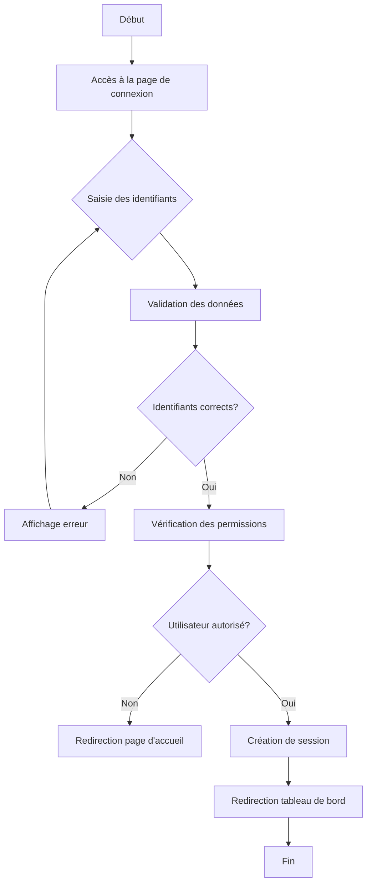
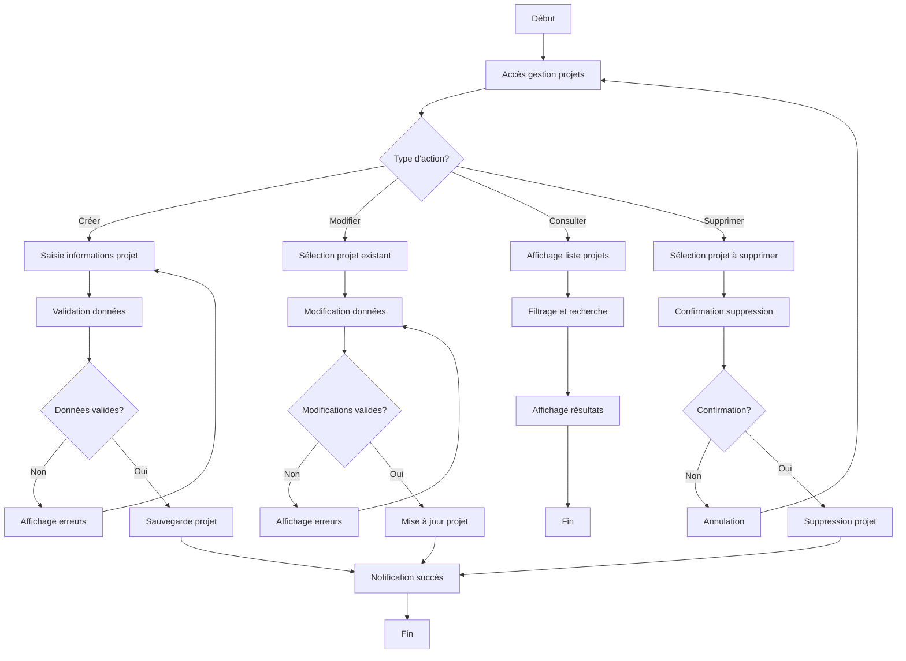
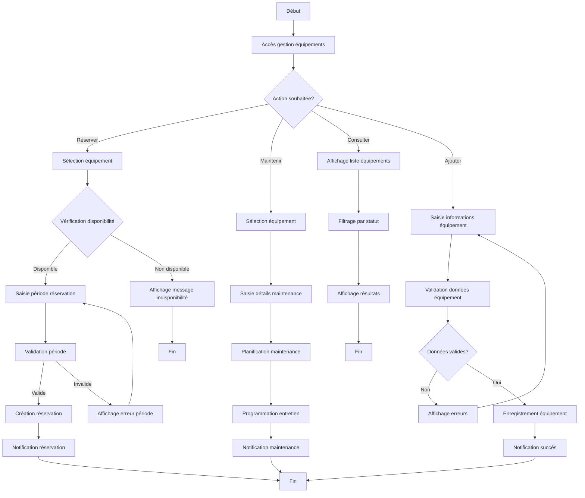
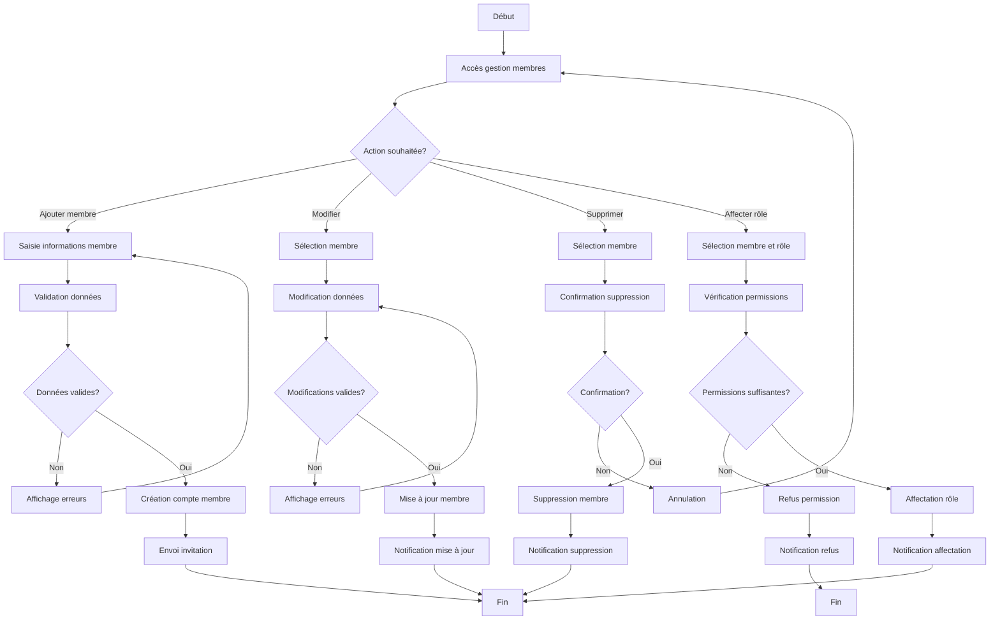
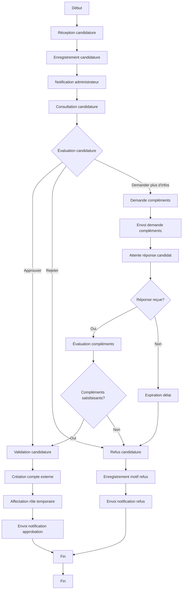
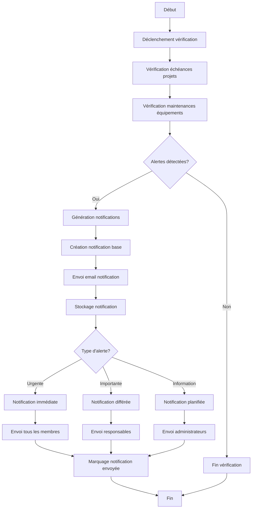
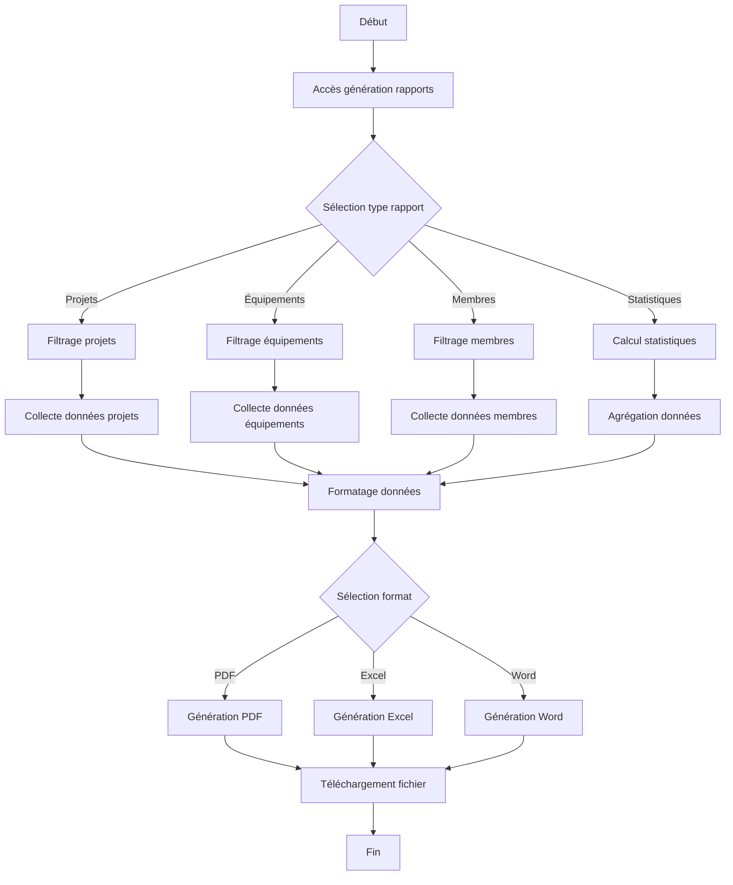
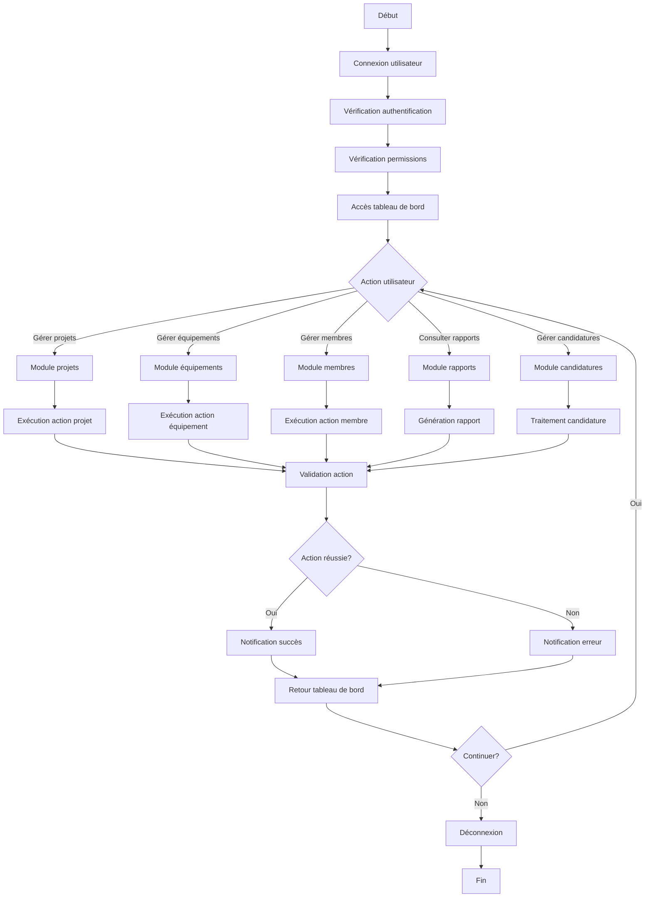

# Diagramme d'Activité - Module Laboratoire

## 1. Connexion et Authentification

## 2. Gestion des Projets

## 3. Gestion des Équipements

## 4. Gestion des Membres

## 5. Traitement des Candidatures

## 6. Système de Notifications et Alertes

## 7. Génération de Rapports

## 8. Flux Principal d'Utilisation

Ces diagrammes d'activité montrent les flux principaux de votre module laboratoire, incluant :
- L'authentification et la gestion des permissions
- La gestion des projets avec validation
- La gestion des équipements avec réservation et maintenance
- La gestion des membres et des rôles
- Le traitement des candidatures
- Le système de notifications et alertes
- La génération de rapports
- Le flux principal d'utilisation

Vous pouvez utiliser ces diagrammes dans votre rapport en les adaptant selon vos besoins spécifiques ou en les simplifiant pour mettre l'accent sur les aspects les plus importants de votre module. 
